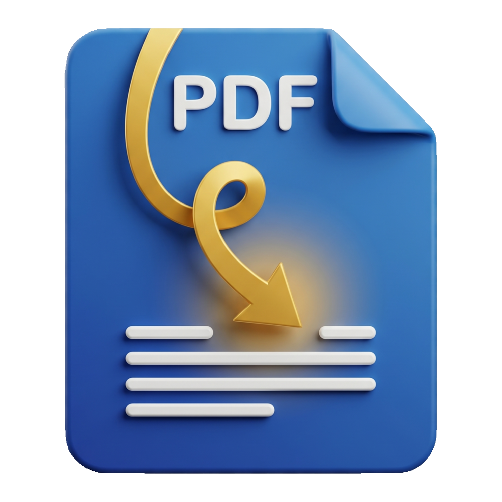

# microPDF

<div align="center">
  
  
  <h3>Simple, Fast, and Elegant PDF Compression</h3>
  
  <p>
    <a href="#features">Features</a> •
    <a href="#download">Download</a> •
    <a href="#installation">Installation</a> •
    <a href="#usage">Usage</a> •
    <a href="#documentation">Documentation</a>
  </p>
  
  <p>
    
    
    
  </p>
</div>

---

## 📖 About

**microPDF** is a modern desktop application for compressing PDF files with an intuitive interface. Built with Electron and Python, it offers powerful compression while maintaining document quality.

### Why microPDF?

- 🎨 **Beautiful UI** - Clean, modern interface with smooth animations
- ⚡ **Fast Compression** - Efficient image processing for quick results
- 🎯 **5 Quality Presets** - From high quality (90%) to maximum compression (50%)
- 📦 **Batch Processing** - Compress multiple files at once
- 🖱️ **Drag & Drop** - Simply drag files into the app
- 📊 **Real-time Progress** - See compression progress with page counter
- 💾 **Space Saving** - Reduce file size by 60-75% on average

---

## ✨ Features

### Desktop Application (Electron)

- ✅ **Drag & Drop Interface** - Intuitive file selection
- ✅ **Multiple Files Support** - Process many PDFs at once
- ✅ **5 Quality Presets**:
  - High (90%) - For important documents
  - Good (80%) - Recommended balance
  - Medium (70%) - For sharing
  - Fair (60%) - For email
  - Low (50%) - Maximum compression
- ✅ **Custom Output Folder** - Choose where to save
- ✅ **Real-time Progress** - Animated progress with page counter
- ✅ **Compression Statistics** - See size reduction and savings
- ✅ **Modern Blue Theme** - Professional and elegant design

### CLI Script (Python)

- ✅ **Interactive Mode** - User-friendly menu
- ✅ **Single File Mode** - Compress one file
- ✅ **Batch Mode** - Compress entire folders
- ✅ **Quick Mode** - Fast compression with defaults
- ✅ **Adjustable Quality** - Fine-tune compression (1-100)

---

## 📥 Download

### Latest Release

**Version 2026.1.3**

| Platform | Download | Size |
|----------|----------|------|
| 🪟 **Windows** | [microPDF-Setup.exe](#) | ~80 MB |
| 🍎 **macOS** | [microPDF.dmg](#) | ~100 MB |
| 🐧 **Linux** | [microPDF.AppImage](#) | ~80 MB |

> **Note**: Download links will be available after the first release. See [Installation](#installation) for building from source.

---

## 🚀 Installation

### Option 1: Download Pre-built App (Recommended)

1. Download the installer for your platform from [Releases](#download)
2. Run the installer
3. Launch microPDF

### Option 2: Build from Source

#### Prerequisites

- **Node.js** (v16 or higher)
- **Python** (v3.8 or higher)
- **npm** or **yarn**

#### Steps

```bash
# 1. Clone the repository
git clone https://github.com/yourusername/micropdf.git
cd micropdf

# 2. Install Node dependencies
npm install

# 3. Install Python dependencies
pip install -r requirements.txt

# 4. Run the application
npm start
```

#### Build Installers

```bash
# Build for Windows
npm run build:win

# Build for macOS
npm run build:mac

# Build for Linux
npm run build:linux

# Build for all platforms
npm run build
```

Installers will be created in the `dist/` folder.

---

## 💡 Usage

### Desktop Application

1. **Launch microPDF**
2. **Add Files**:
   - Drag & drop PDF files into the window, OR
   - Click "Select Files" button
3. **Choose Quality**:
   - High (90%) - Best quality, larger size
   - Good (80%) - Recommended
   - Medium (70%) - Balanced
   - Fair (60%) - Smaller size
   - Low (50%) - Maximum compression
4. **Select Output Folder**:
   - Click "Browse" to choose destination
5. **Start Compression**:
   - Click "Start Compression"
   - Watch real-time progress
6. **View Results**:
   - See compression statistics
   - Click "Open Folder" to view files

### CLI Script

#### Interactive Mode (Easiest)

```bash
python compress.py
```

Follow the menu prompts.

#### Command Line Mode

```bash
# Single file
python compress.py -s input.pdf output.pdf 80

# Batch folder
python compress.py -b input_folder output_folder 70

# Quick mode (uses defaults)
python compress.py -q 75
```

---

## 📊 Compression Results

### Example Results

**Test File**: 31.04 MB, 286 pages

| Quality | Compressed Size | Reduction | Use Case |
|---------|----------------|-----------|----------|
| 90% | 11.84 MB | 61.84% | Important documents |
| 80% | 10.50 MB | 66.16% | **Recommended** |
| 70% | 9.98 MB | 67.85% | Sharing/Email |
| 60% | 9.30 MB | 70.03% | Web upload |
| 50% | 8.67 MB | 72.06% | Archive/Backup |

### Average Savings

- **High Quality (90%)**: 60-65% reduction
- **Good Quality (80%)**: 65-70% reduction
- **Medium Quality (70%)**: 68-72% reduction
- **Fair Quality (60%)**: 70-73% reduction
- **Low Quality (50%)**: 72-75% reduction

---

## 📚 Documentation

Comprehensive documentation is available in the `docs/` folder:

- **[Quick Start Guide](docs/QUICK_START.md)** - Get started quickly
- **[Electron App Guide](docs/ELECTRON_GUIDE.md)** - Desktop app documentation
- **[Technical Details](docs/TECHNICAL_DETAILS.md)** - Architecture and implementation
- **[Usage Examples](docs/USAGE_EXAMPLES.md)** - CLI examples
- **[Changelog](docs/CHANGELOG.md)** - Version history

### Quick Links

- [Installation Guide](docs/ELECTRON_GUIDE.md#-quick-start)
- [Troubleshooting](docs/ELECTRON_GUIDE.md#-troubleshooting)
- [CLI Usage](docs/USAGE_EXAMPLES.md)
- [API Reference](docs/README.md)

---

## 🛠️ Technology Stack

- **Frontend**: Electron, HTML5, CSS3, JavaScript
- **Backend**: Python 3
- **Libraries**:
  - PyPDF2 - PDF manipulation
  - Pillow - Image processing
  - Electron - Desktop framework

---

## 🎨 Screenshots

### Main Interface


### Compression Progress


### Results


> **Note**: Screenshots will be added in the next update.

---

## 🤝 Contributing

Contributions are welcome! Please feel free to submit a Pull Request.

### Development Setup

```bash
# Clone the repo
git clone https://github.com/yourusername/micropdf.git
cd micropdf

# Install dependencies
npm install
pip install -r requirements.txt

# Run in development mode
npm start
```

### Guidelines

1. Fork the repository
2. Create your feature branch (`git checkout -b feature/AmazingFeature`)
3. Commit your changes (`git commit -m 'Add some AmazingFeature'`)
4. Push to the branch (`git push origin feature/AmazingFeature`)
5. Open a Pull Request

---

## 📝 License

This project is licensed under the MIT License - see the [LICENSE](LICENSE) file for details.

---

## 👤 Author

**Dana Mustofa**

- GitHub: [@danamustofa](https://github.com/danamustofa)

---

## 🙏 Acknowledgments

- Electron team for the amazing framework
- PyPDF2 and Pillow contributors
- All users and contributors

---

## 📮 Support

If you encounter any issues or have questions:

1. Check the [Documentation](docs/INDEX.md)
2. Search [Issues](https://github.com/yourusername/micropdf/issues)
3. Create a [New Issue](https://github.com/yourusername/micropdf/issues/new)

---

<div align="center">
  <p>Made with ❤️ by Dana Mustofa</p>
  <p>
    <a href="#micropdf">Back to Top ↑</a>
  </p>
</div>
